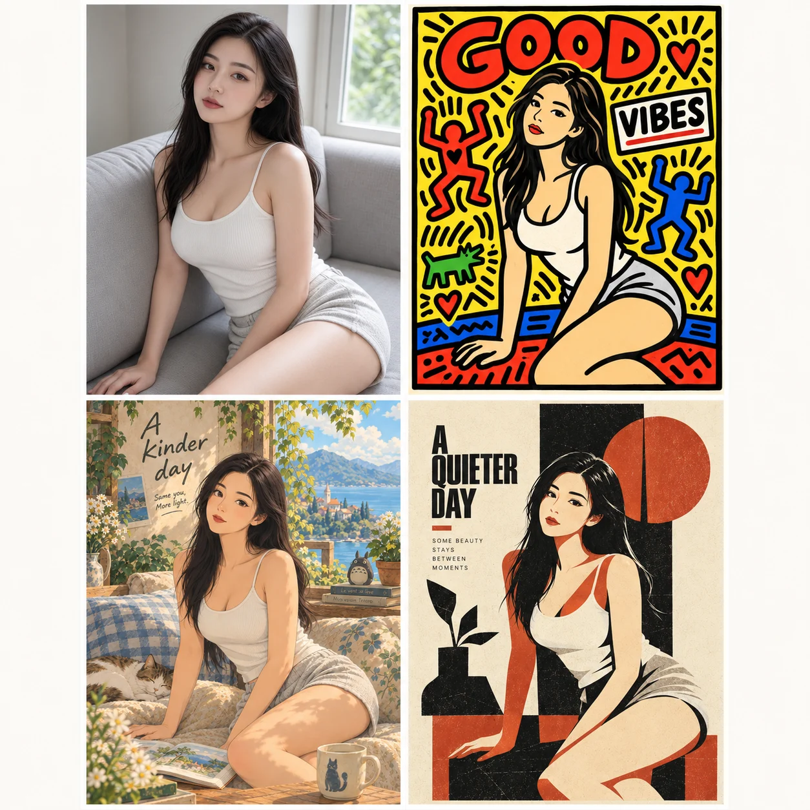

# ArtShift

> 不会写提示词，也能把一张照片换成另一种世界。



把仓库链接丢给 Codex，上传一张照片，就能开始。

## 你只需要做两件事

### 1. 把仓库链接交给 Codex

复制本仓库链接并对 Codex 说：

```text
读取并使用这个仓库里的 SKILL.md，帮我做照片风格迁移。
```

它会读取项目里的风格迁移 Skill；不需要安装环境，也不需要自己研究提示词。

### 2. 选一个你喜欢的方向


双击打开 [index.html](index.html)，在搜索框输入编号，例如 `#001`。看到喜欢的效果后，复制提示词，或直接把照片和编号发给 Codex：

```text
用画廊 #001 对这张照片做风格迁移。
```

画廊里的编号对应已整理好的风格提示词；点击卡片就能查看并复制。

## 不知道选什么？让 Codex 先给你灵感

直接上传照片并说：

```text
给这张照片推荐原创风格迁移提示词。
```

Codex 会根据照片推荐 3 个临时原创方向。选择 `a`、`b`、`c`，或者混搭你喜欢的部分，再生成图片。原创方向只为这一次照片定制，不会把你锁进固定模板。

## 从一张照片开始

1. 发仓库链接给 Codex
2. 上传照片
3. 选编号，或让它推荐临时原创方向
4. 得到你的新风格照片

就这么简单。
