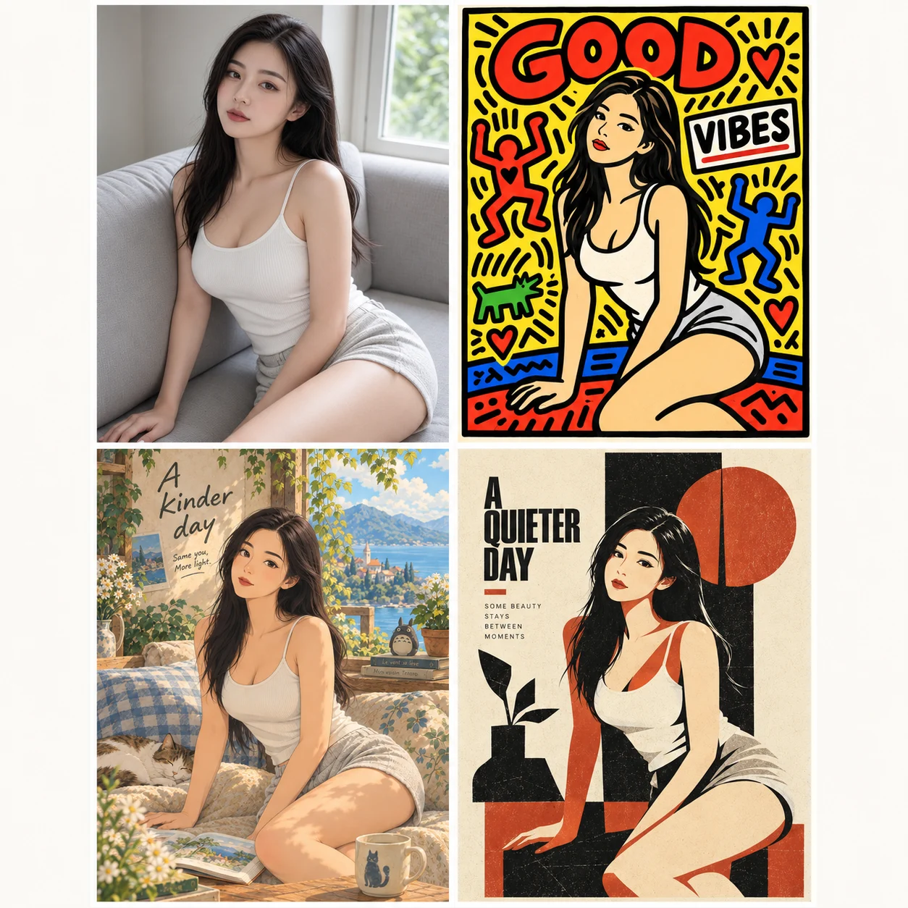
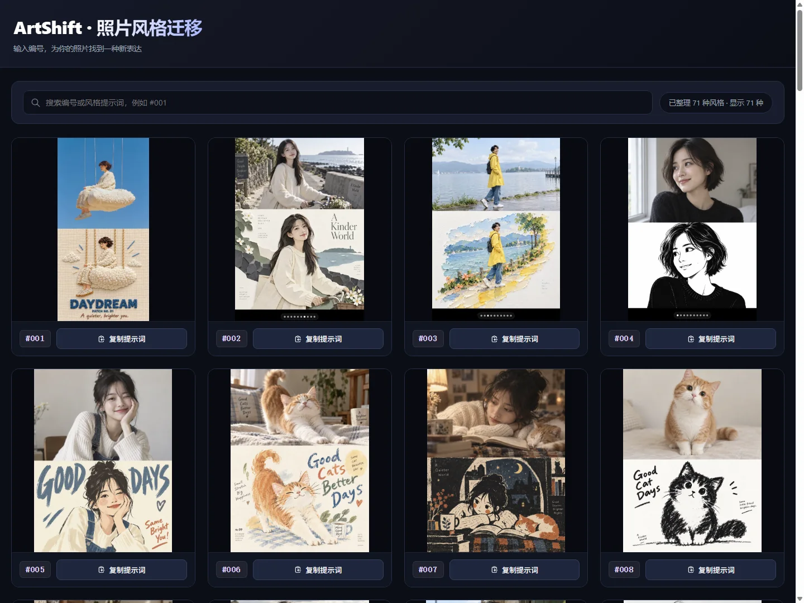

# ArtShift

> 不会写提示词，也能把一张照片换成另一种世界。



把仓库链接丢给 Codex，上传一张照片，就能开始。

👉 **[🖼️ 点击进入完整视觉风格画廊 (GALLERY.md)](GALLERY.md)** —— 收录全部 88+ 款风格高清效果图与复制即用的提示词。

## 你只需要做两件事

### 1. 把仓库链接交给 Codex

复制下面这句话并对 Codex 说：

```text
https://github.com/yang0/ArtShift
```

安装完成后，它会读取项目里的风格迁移 Skill；不需要自己研究提示词。

### 2. 选一个你喜欢的方向



直接进入 **[【🖼️ 完整风格视觉画廊 (GALLERY.md)】](GALLERY.md)**，直观浏览所有已收录风格的高清效果图、专属编号与分类标签。

看到心仪的效果后，记下对应编号（例如 `#088`），直接把照片和编号发给 Codex：

```text
用画廊 #088 对这张照片做风格迁移。
```

画廊里的每个编号都配备了经过实测的高清效果图和完整提示词，点击画廊卡片下方即可直接展开查看并复制完整 Prompt。

## 不知道选什么？让 Codex 先给你灵感

直接上传照片并说：

```text
给这张照片推荐原创风格迁移提示词。
```

Codex 会根据照片推荐 3 个临时原创方向。选择 `a`、`b`、`c`，或者混搭你喜欢的部分，再生成图片。原创方向只为这一次照片定制，不会把你锁进固定模板。

## 从一张照片开始

1. 发仓库链接给 Codex
2. 上传照片
3. 在 [GALLERY.md](GALLERY.md) 挑选中意风格编号，或让它推荐临时原创方向
4. 得到你的新风格照片

就这么简单。
